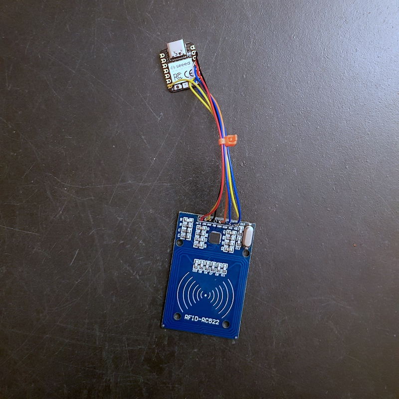

# Lecture/écriture d'un tag RFID/NFC avec lecteur RC522
CircuitPython class to access the MFRC522 RFID reader

<small>Based on the [wendlers/micropython-mfrc522](https://github.com/wendlers/micropython-mfrc522) MicroPython library.

Basic class to access RFID readers of the type [MFRC522](http://www.nxp.com/documents/data_sheet/MFRC522.pdf).
This is basically a re-write of [this](https://github.com/mxgxw/MFRC522-python) Python port for the MFRC522. I
tried to strip things down and make them more "pythonic" so the result is small enough to run on
[CircuitPython](https://github.com/adafruit/circuitpython) boards.

## Usage


Put the modules ``mfrc522.py``, ``examples/read.py``, ``examples/write.py`` to the root of the flash FS on your board.

I used the following pins for my setup:

| Signal    | GPIO RP2040 XIAO | Note                                 |
| --------- | ---------------- | ------------------------------------ |
| sck       | D8               |                                      |
| mosi      | D10              |                                      |
| miso      | D9               |                                      |
| rst       | D6               |                                      |
| cs        | D7               |Labeled SDA on most RFID-RC522 boards |

Now enter the REPL you could run one of the two examples:

This will wait for a MifareClassic 1k card. As soon the card is detected, it is authenticated, and
16 bytes are read from address 0x08.

For detecting, authenticating and writing to a card:

    import write
    write.do_write()

This will wait for a MifareClassic 1k card. As soon the card is detected, it is authenticated, and
16 bytes written to address 0x08.

`circuitpython/code.py` :
lit le tag sur le lecteur (refactor du code de `do_read.py`), envoie l'uuid en `controlChange` midi (port 0 à 7) en 2 * 7bits.

> nb: les uuid de tags nfc sont encodés en 4 * 8bits(0-255). Le midi supporte uniquement des nombres jusqu'à 7bits (0-127). Le nombre est découpé en 2 * 7 bits et reconstitué dans le code de lecture (en html et Processing, ici).

## récupération de l'uuid (midiEvent) en js
``` js
function midiMessageReceived(event) {
    if (midi[event.data[1]] != null) {
      port = event.data[1];
        valeur = event.data[2];
        switch(port) {
          case 7:
            tag[Math.floor(port/2)] += valeur;
            document.body.innerHTML += `uuid : <strong>${tag[0].toString(16)} ${tag[1].toString(16)} ${tag[2].toString(16)} ${tag[3].toString(16)}</strong><br>`;
            break;
          default:
            //println(number,value,hex(value),"générique");
            if (port%2 == 0) { // debut de chiffre
              tag[Math.floor(port/2)] = valeur*128;
            } else {
              tag[Math.floor(port/2)] += valeur;
              console.log(`${tag[Math.floor(port/2)].toString(16)}`)
            }
        }
    }
}
```

## récupération de l'uuid avec themidibus avec Processing
```processing
import themidibus.*;

MidiBus bus;
int tag[] = new int[4];

void setup() {
  MidiBus.list();
  // 1 -> numero dans liste des input
  //MidiBus(java.lang.Object parent, int in_device_num, int out_device_num)
  bus = new MidiBus(this, 1,2);
}

void controllerChange(int channel, int number, int value) {
    switch(number) {
      case 7:
        tag[floor(number/2)] += value;
        println("uuid :",hex(tag[0],2),hex(tag[1],2),hex(tag[2],2),hex(tag[3],2));
        break;
      default:
        //println(number,value,hex(value),"générique");
        if (number%2 == 0) { // debut de chiffre
          tag[floor(number/2)] = value*128;
        } else {
          tag[floor(number/2)] += value;
        }
    }
}
```
